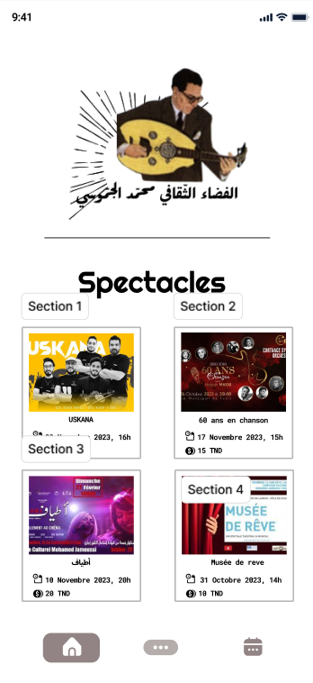
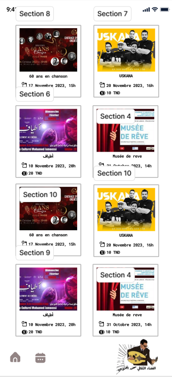
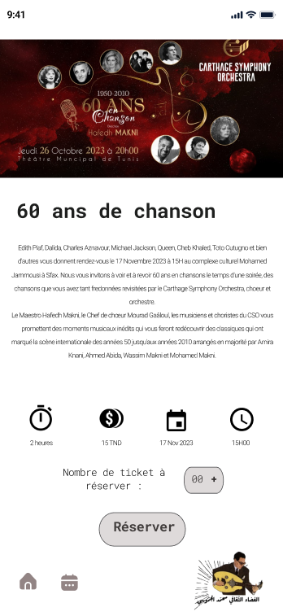
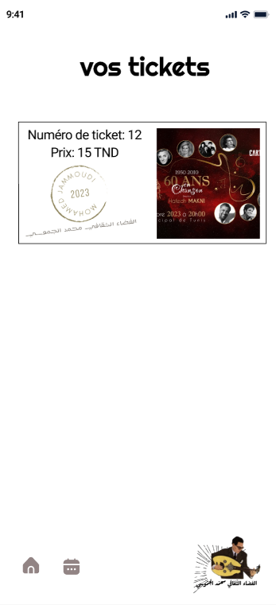
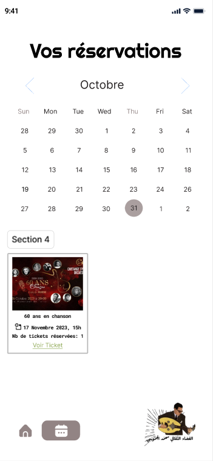

<div align="center">


<h1>Mohamed Jammoussi Cultural Complex</h1>


<p>A Flutter ticketing experience for discovering cultural shows, exploring event details, and reserving tickets in Sfax, Tunisia.</p>

<a href="https://flutter.dev"></a>
<a href="https://dart.dev"></a>


</div>

<br>

<div align="center">
<a href="#overview">Overview</a> ·
<a href="#features">Features</a> ·
<a href="#installation">Installation</a> ·
<a href="#application-interface">Interface</a> ·
<a href="#security">Security</a>
</div>

## Overview

The Mohamed Jammoussi Cultural Complex app brings a curated program of music, theatre, and live performances into one focused mobile interface. Visitors can browse the current catalog, open a complete show profile, choose a ticket quantity, and generate a simple reservation view.

This repository contains the final version of the Flutter project, including its Android, iOS, web, macOS, Linux, and Windows platform targets.

## Features

- Browse available shows in a visual catalog.
- Open detailed event pages with artwork, schedule, date, duration, price, and description.
- Select a ticket quantity before starting a reservation.
- View a reservation ticket with the event information and official stamp artwork.
- Access dedicated login and calendar entry points from the application navigation.
- Use the same Flutter codebase across supported desktop, mobile, and web targets.

## Tech Stack

- **Framework:** Flutter
- **Language:** Dart
- **UI:** Material Design widgets
- **Calendar:** [`table_calendar`](https://pub.dev/packages/table_calendar)
- **Platforms:** Android, iOS, Web, Windows, macOS, and Linux
- **Assets:** Local event artwork and brand imagery stored in `assets/images/`

## Project Structure

```text
complexe_jammoussi/
├── android/                 # Android host project
├── assets/images/           # Logos, posters, and reservation artwork
├── ios/                     # iOS host project
├── lib/                     # Flutter application source
│   ├── main.dart            # Application entry point and show catalog
│   ├── LoginPage.dart       # Login screen
│   ├── calendrier_Page.dart # Calendar screen entry point
│   └── SpectaclesReservesPage.dart # Reservation ticket view
├── test/                    # Flutter widget tests
├── web/                     # Web host project
├── linux/                   # Linux host project
├── macos/                   # macOS host project
├── windows/                 # Windows host project
├── analysis_options.yaml    # Dart and Flutter analysis rules
├── pubspec.yaml             # Package metadata and dependencies
└── README.md
```

Flutter projects conventionally use `lib/` as the source directory, so no artificial `src/` directory is added.

## Requirements

- Flutter SDK 3.x or later
- Dart SDK `>=3.1.5 <4.0.0`
- A configured device, emulator, or desktop target

Check your local setup with:

```bash
flutter doctor
```

## Installation

1. Clone the repository:

	```bash
	git clone <your-github-repository-url>
	cd complexe_jammoussi
	```

2. Install Flutter dependencies:

	```bash
	flutter pub get
	```

3. Run the application:

	```bash
	flutter run
	```

To select a specific target, use `flutter devices` and then run, for example:

```bash
flutter run -d chrome
```

## Usage

1. Start the app to open the available shows catalog.
2. Tap a show card to inspect its details.
3. Choose the number of tickets and press **Reserve**.
4. Review the generated reservation ticket.
5. Use the bottom navigation to return home, open the login screen, or access the calendar entry point.

## Application Interface

The interface below is based on the application's Figma design screens. Exported interface previews can be placed in `docs/screenshots/` and linked in this section.

| Screen | Preview | Purpose |
| --- | --- | --- |
| Home and show catalog |  | Browse available cultural events and featured shows. |
| Home catalog - extended view |  | Explore additional shows in the catalog layout. |
| Show details |  | View the event artwork, date, time, duration, price, and description. |
| Reserved ticket |  | Review the selected show and reservation information. |
| Calendar screen |  | Explore the event calendar and scheduled performances. |

### Figma Design Preview

Add the exported Figma screens here when they are available:

```text
docs/
└── screenshots/
	├── home_screen.png
	├── home_screen_scroll.png
	├── show_details.png
	├── reserved_ticket.png
	└── calendar_screen.png
```

## Quality Checks

Run the automated checks before opening a pull request or publishing a release:

```bash
flutter analyze
flutter test
```

## Security

This project currently has no external API or database credentials. Local environment files, private keys, signing files, generated build output, and machine-specific configuration are excluded through `.gitignore`.

Before pushing changes, inspect the staged files:

```bash
git diff --cached --name-only
git diff --cached
```

Never commit passwords, API keys, access tokens, signing certificates, or real `.env` files. If a secret is ever exposed, revoke it first and then remove it from the Git history.

## License

Distributed under the MIT License. See [LICENSE](LICENSE) for the full text.

## Author

**Mohamed Jammoussi Cultural Complex project**

Built as a Flutter cultural events and ticket reservation application for Sfax, Tunisia.

## Keywords

`Flutter` `Dart` `cultural-events` `ticket-reservation` `event-booking` `Sfax` `Tunisia` `mobile-app` `Material-Design` `live-shows`
